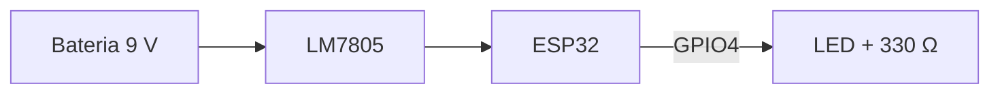

# M0.7.T04 — Documentação técnica e Markdown

## Ao final você consegue
- Escrever documentos em Markdown com títulos, listas, tabelas, links, imagens e blocos de código que renderizam corretamente no GitHub.
- Estruturar o README de um projeto de hardware com propósito, estado, BOM, montagem, teste e licença.
- Representar ligações e fluxos com diagramas em texto (Mermaid) e registrar decisões técnicas (ADR) com contexto, alternativas e consequências.
- Redigir um relatório de teste reprodutível com objetivo, montagem, procedimento, critério de aceitação, resultados e conclusão.

## Estude
Tempo previsto: ~11 h (≈ 3 h de leitura, ≈ 6 h escrevendo no seu repositório de treino do T02, ≈ 2 h de revisão e reescrita).
- GitHub Docs (docs.github.com) — *Get started → Writing on GitHub → Basic writing and formatting syntax*; *Organizing information with tables*; *Creating diagrams* (Mermaid); *About READMEs*; *Licensing a repository*.
- *CommonMark Spec* (spec.commonmark.org) e *GitHub Flavored Markdown Spec* (github.github.com/gfm): leia as seções de exemplos de *Paragraphs*, *Soft line breaks*, *Hard line breaks*, *Fenced code blocks* e *Tables (extension)* — só os exemplos, não a especificação inteira.
- Documentação do Mermaid (mermaid.js.org) — *Flowcharts Syntax* (nós, setas, direção) e *Sequence Diagrams* (só os primeiros exemplos).
- Michael Nygard — *Documenting Architecture Decisions* (cognitect.com/blog, 2011): o texto que originou os ADRs; e o repositório *adr.github.io* com modelos.
- Open Source Hardware Association — *Best Practices for Open Source Hardware* (oshwa.org): o que publicar para um hardware ser reproduzível (esquema, BOM, arquivos-fonte, instruções, fotos).
- ISO/IEC/IEEE 29119-3 — *Test documentation* (só como referência; é norma paga): os modelos de especificação de caso de teste e de relatório de resultado mostram quais campos um relatório de teste precisa ter.
- Exemplos reais para ler com olhar crítico: os READMEs de repositórios de placas da Adafruit e da SparkFun no GitHub (ex.: um *breakout* de sensor) — note a ordem das seções.

## Resumo
**1. Markdown em 10 minutos.** Texto puro que vira página formatada. No GitHub vale o **GFM** (CommonMark + tabelas, listas de tarefas, tachado e alguns extras).
- Títulos: `# Título` (nível 1, um por documento), `## Seção`, `### Subseção`. Precisa do espaço depois do `#`.
- Parágrafos são separados por **linha em branco**. Uma quebra de linha simples dentro de um parágrafo vira um espaço; para forçar quebra, termine a linha com `\` (ou dois espaços).
- Ênfase: `*itálico*`, `**negrito**`, `` `código` `` (nomes de arquivos, comandos, pinos: `GPIO4`).
- Listas: `- item` ou `1. item`; sublista com recuo; tarefas: `- [ ] testar ripple`.
- Link: `[datasheet do LM7805](https://www.ti.com/...)`. Imagem: o mesmo com `!` na frente: ``. Use **caminho relativo** ao arquivo (funciona no GitHub e em qualquer clone); caminho absoluto do seu PC (`/home/matheus/...`) quebra para todo mundo. O texto entre colchetes da imagem é o texto alternativo: descreva a foto.
- Bloco de código com cerca e linguagem (destaque de sintaxe):
  ````
  ```bash
  screen /dev/ttyUSB0 115200
  ```
  ````
- Tabela: linha de cabeçalho, linha separadora (obrigatória) e linhas de dados; `:` alinha.
  ```
  | Ponto | Esperado (V) | Medido (V) |
  |---|---:|---:|
  | TP1 (saída 7805) | 5,00 | 4,98 |
  ```
- Citação: `> Nota:`. Linha horizontal: `---`.

**2. README de projeto de hardware.** É a porta de entrada: quem chega precisa saber em 30 segundos o que é, se funciona e como reproduzir. Ordem sugerida:
1. **Nome e uma frase** do que faz + foto.
2. **Estado** (protótipo, testado, abandonado) e versão da placa (rev A, rev B).
3. **Especificações**: alimentação (tensão, corrente, conector, **polaridade**), entradas e saídas, dimensões.
4. **Esquema** (PDF/PNG) e diagrama de blocos.
5. **BOM** (lista de materiais): referência (R1, C2), valor, encapsulamento, quantidade, código do fabricante ou do fornecedor.
6. **Montagem**: ordem, cuidados (polaridade de eletrolíticos e diodos, orientação do CI).
7. **Teste**: como verificar, com valores esperados e tolerância.
8. **Estrutura do repositório**, **licença** (hardware: CERN-OHL ou similar; código: MIT, GPL…; documentação: CC BY) e contato.

Sem arquivo de licença, vale o direito autoral padrão: os outros podem ver (e, no GitHub, fazer fork pela interface), mas não têm permissão para reutilizar, modificar ou distribuir.

**3. Diagramas em texto (Mermaid).** O GitHub renderiza blocos `mermaid`, e o diagrama fica versionado como código (o `diff` mostra o que mudou):
````

````
A primeira linha declara o tipo (`flowchart LR` = da esquerda para a direita; `TD` = de cima para baixo); `-->` é seta; `-->|texto|` põe rótulo na seta. Para trocas de mensagem no tempo (ex.: ESP32 ↔ servidor MQTT), use `sequenceDiagram`. Diagrama em texto **não substitui o esquema elétrico**: serve para blocos, fluxos e protocolos.

**4. Registro de decisões (ADR).** Decisões técnicas se perdem; meses depois ninguém lembra por que se escolheu um LDO e não um conversor buck. Um ADR é um arquivo curto e numerado (`docs/adr/0003-regulador-ldo.md`) com:
- **Título** e **Status** (proposta, aceita, substituída por ADR-000X).
- **Contexto**: o problema e as restrições daquele momento (consumo, custo, ruído, prazo).
- **Decisão**: o que foi escolhido, em voz ativa ("Usaremos…").
- **Consequências**: o que fica mais fácil e o que fica mais difícil (inclusive as negativas).
- (útil) **Alternativas consideradas** e por que foram descartadas.
ADR aceito não é editado para mudar a decisão: se a decisão muda, escreve-se um **ADR novo** que o substitui, e o antigo recebe o status "substituído por…". Assim o histórico do raciocínio fica preservado.

**5. Relatório de teste.** Objetivo: outra pessoa repete o teste e chega ao mesmo resultado; e qualquer um sabe se passou ou não.
1. **Identificação**: item testado (placa, revisão, número de série), data, quem testou.
2. **Objetivo**: o que se quer verificar ("tensão de saída do regulador em toda a faixa de carga").
3. **Equipamentos**: modelo e número de série do multímetro, fonte, carga; ambiente (temperatura).
4. **Montagem**: diagrama ou foto das ligações e pontos de medição.
5. **Procedimento**: passos numerados, com valores ajustados.
6. **Critério de aceitação**: definido **antes** de medir (ex.: 4,75 V ≤ V_out ≤ 5,25 V de 0 a 500 mA).
7. **Resultados**: tabela com valores **medidos**, unidade, instrumento e faixa; anomalias anotadas, não escondidas.
8. **Conclusão**: aprovado/reprovado frente ao critério, com números, e próximos passos.
Escreva "4,98 V", nunca "a tensão ficou boa". Um único item fora do critério reprova o lote naquele critério — a média não esconde o defeito.

## Pratique
Use o repositório de treino do T02 e veja cada resultado renderizado no GitHub.
1. Escreva um `NOTAS.md` com título, três seções, uma lista de tarefas, um trecho de código bash e um link para o datasheet do LM7805.
2. Faça uma tabela com 5 resistores (nominal, medido, desvio %) e alinhe os números à direita.
3. Tire uma foto da sua bancada, ponha em `fotos/` e insira no Markdown com texto alternativo descritivo.
4. Escreva dois parágrafos separados só por quebra simples de linha e veja o resultado; corrija.
5. Escreva o README de um projeto imaginário "Sensor de temperatura com ESP32 e DHT22" seguindo as 8 seções do Resumo.
6. Desenhe em Mermaid o diagrama de blocos desse sensor (alimentação USB → regulador 3,3 V → ESP32 → DHT22; ESP32 → Wi-Fi → MQTT).
7. Faça um `sequenceDiagram` do ESP32 publicando uma leitura num broker MQTT e recebendo a confirmação.
8. Escreva o ADR-0001 "Usar DHT22 em vez de LM35" com contexto, decisão, consequências e alternativas.
9. Escreva o ADR-0002 que substitui o 0001 ("trocar DHT22 por SHT31 por precisão e interface I²C") e atualize o status do 0001.
10. Escreva o relatório de teste da medição de 5 resistores que você fez no M0.4.T08, com critério de aceitação pela tolerância.
11. Reescreva, como resultado de relatório, a frase "o regulador esquentou um pouco mas a tensão ficou ok".

## Armadilhas comuns
- Esquecer a linha separadora `|---|---|` da tabela: vira texto corrido.
- Caminho de imagem absoluto (`/home/matheus/fotos/...`) ou com maiúsculas trocadas (o GitHub diferencia `Placa.JPG` de `placa.jpg`).
- Achar que Enter simples cria novo parágrafo.
- README que diz "alimente a placa" sem dizer tensão, conector e polaridade.
- Editar o ADR antigo em vez de escrever um novo que o substitui.
- Definir o critério de aceitação depois de ver os números.
- Relatório sem instrumento e sem unidade; "aprovado" sem número.

## Gabarito
1. Confira no GitHub: o link deve abrir o PDF; o bloco de código com destaque de bash.
2. `|---|---:|---:|` alinha a 2ª e a 3ª colunas à direita.
3. ``.
4. As duas linhas aparecem juntas no mesmo parágrafo; separe com uma linha em branco.
5. Confira se alguém sem contexto consegue: saber o que é, alimentar sem queimar, montar e testar.
6. Ex.: `flowchart LR` / `USB[USB 5 V] --> REG[LDO 3,3 V] --> ESP[ESP32]` / `ESP --> DHT[DHT22]` / `ESP -->|Wi-Fi| MQTT[(Broker MQTT)]`.
7. `sequenceDiagram` / `ESP32->>Broker: PUBLISH temp=23,5` / `Broker-->>ESP32: PUBACK`.
8. Contexto: precisa de temperatura e umidade, 3,3 V, baixo custo; Decisão: DHT22; Consequências: um fio só, mas leitura lenta (≥ 2 s) e protocolo próprio; Alternativa: LM35 (só temperatura, analógico, precisa de 4 V ou mais).
9. 0002 com status "aceita" e contexto citando o 0001; 0001 com status "substituída por ADR-0002".
10. Critério: |medido − nominal| ≤ tolerância (ex.: 5 %) + exatidão do multímetro; tabela; conclusão por resistor.
11. Ex.: "V_out = 4,97 V com carga de 300 mA (multímetro X, faixa 6 V); critério 4,75–5,25 V: aprovado. Temperatura do encapsulamento ≈ 60 °C (termômetro IR), dentro do limite; registrar para o teste térmico."
