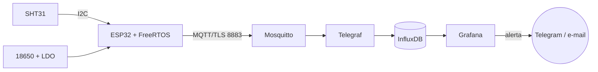

# M1.12.T01 — Requisitos e arquitetura

> Tópico de **elite** (projeto). Tempo previsto: ~25 h — ≈ 5 h de estudo (IEEE 29148, o texto de Nygard sobre ADRs, o capítulo de arquitetura de Elecia White, noções de FMEA), ≈ 3 h para escolher a variante e levantar números (datasheets, preços, a rede do local de instalação), ≈ 13 h de laboratório (documento de requisitos, diagrama de blocos, ADRs, FMEA, plano de testes e uma prova de conceito do maior risco), ≈ 4 h de revisão de projeto e correções. Este módulo não ensina teoria nova: ele **junta** o Ato 0 e o Ato 1 inteiros num produto pequeno e completo, uma **estação de monitoramento a bateria** que mede, decide, fala por MQTT/TLS com um broker próprio, alimenta um dashboard com alertas, dura meses com uma carga **medida** e termina num repositório público com README, diagrama, BOM e vídeo. Cada tópico é uma etapa, com **entregáveis verificáveis**, **critérios de aceite** e uma **revisão de projeto**. Esta primeira etapa é a mais barata e a que mais economiza: um requisito mal escrito aqui vira semanas de retrabalho no T05. O projeto de verdade usa hardware; as alternativas sem hardware (Wokwi, broker local, dados simulados) servem para adiantar o trabalho e para quem ainda espera a compra, nunca para substituir as medidas finais.

## Ao final você consegue
- Escrever o documento de requisitos de um nó IoT a bateria, escolhendo uma das variantes do projeto, separando requisitos funcionais e não funcionais e redigindo cada um de forma SMART e verificável segundo as características da IEEE 29148.
- Desenhar a arquitetura de ponta a ponta (diagrama de blocos do sensor à notificação, interfaces, árvore de tópicos e formato das mensagens) e registrar as decisões principais em ADRs no formato de Nygard.
- Identificar os riscos do projeto e os modos de falha do produto, montar uma FMEA pequena com severidade, ocorrência, detecção e RPN e definir as ações que reduzem os itens mais críticos.
- Montar o plano de testes com a matriz de rastreabilidade requisito → teste, o método de verificação de cada requisito (inspeção, análise, demonstração ou teste) e os critérios de aceite de cada etapa do projeto.

## Estude
- ISO/IEC/IEEE **29148:2018** — *Systems and software engineering — Life cycle processes — Requirements engineering*: as seções *Requirements construct*, *Characteristics of individual requirements* (necessário, apropriado, inequívoco, completo, singular, viável, verificável, correto, conforme), *Characteristics of a set of requirements*, *Requirement language criteria* (os termos vagos a evitar) e *Requirements attributes* (identificação, prioridade, fonte, justificativa, método de verificação). A norma é paga; a biblioteca da empresa ou da universidade costuma ter acesso.
- NASA — *Systems Engineering Handbook* (NASA/SP-2016-6105 Rev2, gratuito): *Technical Requirements Definition*, *Product Verification* (os quatro métodos: análise, demonstração, inspeção e teste) e o apêndice *How to Write a Good Requirement — Checklist*. É o substituto gratuito mais próximo da 29148.
- Karl Wiegers e Joy Beatty — *Software Requirements* (3ª ed.): o capítulo *Writing excellent requirements* e a parte sobre requisitos de qualidade (*Specifying quality attributes*). George T. Doran — *There's a S.M.A.R.T. way to write management's goals and objectives* (Management Review, 1981): a origem do SMART.
- Michael Nygard — **Documenting Architecture Decisions** (blog da Cognitect, 2011): o formato *Title*, *Context*, *Decision*, *Status*, *Consequences*. E o site **adr.github.io** (modelos e a ferramenta adr-tools).
- Elecia White — *Making Embedded Systems* (O'Reilly): o capítulo *Creating a System Architecture* (diagramas de contexto, de blocos e de camadas; *Designing for Change*) e, para a etapa de energia, *Reducing Power Consumption*.
- Simon Brown — **The C4 model** (c4model.com): *System context diagram* e *Container diagram*, uma notação simples para o diagrama de ponta a ponta.
- AIAG & VDA — *FMEA Handbook* (2019), só como referência geral: a abordagem em sete passos, as escalas de severidade, ocorrência e detecção e a **Prioridade de Ação (AP)** que substituiu o RPN nas indústrias automotivas. Aqui usamos o RPN clássico, mais simples para começar.
- Revise: M0.1.T01 (camadas da IoT), M0.7.T02 (Git e GitHub) e M0.7.T04 (documentação técnica e Markdown), M1.7.T09 (o projeto de 4 tarefas, que já começou por requisitos), M1.9.T09 (escolher a rede certa), M1.10.T02 (MQTT) e M1.10.T06 (broker próprio), M1.11.T02 (orçamento de energia).

## Resumo
**1. O projeto e as variantes.** Todas as variantes têm a mesma espinha: **sensor → ESP32 com FreeRTOS → Wi-Fi → MQTT sobre TLS → broker próprio → banco de séries temporais → dashboard e alertas**, alimentadas por **bateria**, com **deep sleep** e autonomia **medida** pelo método do M1.11.T04. Escolha uma:

| Variante | O que mede | Sensor sugerido | Alerta típico | O que a torna difícil |
|---|---|---|---|---|
| **A — Ambiente** (depósito, sala de equipamentos, estufa) | temperatura e umidade | SHT31 ou SHT4x (I²C, calibrado de fábrica, CRC) | T > 30 °C | pouco: é a variante de referência deste roteiro |
| **B — Reservatório** (caixa d'água, cisterna) | nível por ultrassom | JSN-SR04T à prova d'água (ou VL53L1X em tanque pequeno) + DS18B20 para corrigir a velocidade do som | nível < 20 % | sensor que consome mais, zona morta perto do sensor, ecos na parede, umidade |
| **C — Câmara fria** (geladeira de comércio, faixa 2–8 °C) | temperatura | DS18B20 com sonda à prova d'água passando pela vedação da porta | T > 8 °C por mais de 10 min | a bateria e a placa ficam **fora** do frio; porta aberta não pode virar alarme falso |

A variante pode mudar o sensor, mas não pode tirar nenhuma camada: o que se avalia é a **integração** e as **provas**.

**2. Requisitos: funcionais × não funcionais.** Um **requisito funcional** diz **o que** o sistema faz ("medir", "enviar", "alertar"). Um **não funcional** diz **quão bem**, sob que **restrição** ("exatidão de ±0,5 °C", "autonomia ≥ 6 meses", "custo ≤ R$ 150", "TLS 1.2"). Em IoT a bateria são os não funcionais que matam o produto: quase todo nó "funciona" na bancada; poucos funcionam seis meses numa parede.

A 29148 pede que **cada requisito** seja necessário, inequívoco, **singular** (uma coisa só por frase), viável e **verificável**, e que o **conjunto** seja completo e consistente. Na prática, o teste é: *dá para escrever o teste que prova o requisito, com número e procedimento, antes de construir?* Se não dá, o requisito ainda não existe.

**SMART** é a mesma ideia em lista: **S**pecífico, **M**ensurável, **A**tingível, **R**elevante e com **T**empo (prazo ou janela de medida). Compare:

| Ruim | Por quê | Reescrito |
|---|---|---|
| "A estação deve ter boa autonomia." | vago, não mensurável | "RNF-02: a autonomia projetada a partir do perfil de corrente medido deve ser ≥ 6 meses (183 dias) com margem de projeto de 30 %, com a bateria de 2600 mAh da BOM." |
| "O alerta deve ser rápido." | "rápido" não se mede | "RNF-03: a notificação de alerta deve chegar ao celular em ≤ 60 s contados a partir da medida que cruza o limiar, em pelo menos 19 de 20 ensaios." |
| "Medir temperatura e umidade e mandar para a nuvem com segurança." | não singular (três requisitos), "segurança" vaga | RF-01 (medir), RF-02 (enviar), RNF-04 (TLS, credencial por dispositivo, ACL) |
| "O sensor deve ser preciso." | "preciso" ≠ exato; sem faixa | "RNF-01: erro de temperatura ≤ ±0,5 °C entre 0 e 40 °C após calibração, verificado num ponto que não foi usado no ajuste." |

Palavras a caçar no documento (*Requirement language criteria*): "rápido", "fácil", "robusto", "adequado", "etc.", "se possível", "no mínimo razoável", "suportar", "otimizar". E use **deve** para obrigação; **pode** para opção.

**3. O documento de requisitos de referência (variante A).** É curto de propósito: um projeto de 150 h cabe em ~15 requisitos.

| ID | Requisito | Prioridade | Verificação |
|---|---|---|---|
| RF-01 | Medir temperatura e umidade relativa a cada 300 s ± 10 s. | deve | teste (log de 24 h) |
| RF-02 | Enviar as medidas ao broker em lotes, com no máximo 30 min entre a medida e a chegada ao banco, fora dos alertas. | deve | teste |
| RF-03 | Ao medir T acima do limiar alto (padrão 30 °C) ou abaixo do limiar baixo (padrão 10 °C), publicar um alerta na mesma vigília; a volta ao normal exige histerese de 0,5 °C. | deve | teste |
| RF-04 | Guardar até 48 medidas não enviadas (4 h) quando a rede ou o broker falharem e enviá-las, em ordem, quando voltarem. | deve | teste |
| RF-05 | Incluir em cada lote: tensão da bateria, RSSI, contador de boots, causa do último reset, versão do firmware e medidas perdidas. | deve | inspeção + teste |
| RF-06 | Aceitar novos limiares e período por uma mensagem retida de configuração, aplicada no próximo envio. | pode | demonstração |
| RF-07 | Mostrar no dashboard as últimas 24 h e 30 dias de T, UR, bateria e RSSI e a idade do último dado. | deve | demonstração |
| RF-08 | Alertar "estação muda" quando nenhum lote chegar em 65 min e "bateria baixa" quando V_bat < 3,45 V. | deve | teste |
| RNF-01 | Erro de T ≤ ±0,5 °C e de UR ≤ ±3 %UR entre 0 e 40 °C após calibração, verificado num ponto independente. | deve | teste |
| RNF-02 | Autonomia projetada pelo perfil medido ≥ 6 meses (183 dias) com margem de 30 %. | deve | análise + teste |
| RNF-03 | Alerta no celular em ≤ 60 s a partir da medida, em ≥ 19 de 20 ensaios. | deve | teste |
| RNF-04 | MQTT sobre TLS ≥ 1.2 com verificação do certificado do broker; usuário e senha por dispositivo; ACL restringe cada estação ao próprio ramo. | deve | teste (inclusive negativo) |
| RNF-05 | ≥ 99 % das medidas no banco num ensaio de 7 dias (contagem pelo número de sequência). | deve | teste |
| RNF-06 | Custo da BOM ≤ R$ 150 por unidade (protótipo, sem frete). | deve | inspeção |
| RNF-07 | Ciclo acordado ≤ 30 s no pior caso (supervisor) e ciclo de envio ≤ 3 s no percentil 95. | deve | teste |

Repare que **RNF-02 e RNF-03 já trazem o método de medida** (perfil medido; 19 de 20 ensaios). Requisitos de energia e latência sem método viram discussão sem fim no aceite.

**4. Os números antes do código.** Dois requisitos precisam de conta **agora**, com números de datasheet, para descobrir se a arquitetura é viável.

**Orçamento preliminar de energia (M1.11.T02).** Estimativas: sono 15 µA (ESP32 em deep sleep, LDO de baixo Iq, fugas); acordar só para medir: 0,3 s a 40 mA = **12 mA·s**; acordar, conectar Wi-Fi, TLS, publicar: 2,5 s a 110 mA = **275 mA·s**. Bateria Li-ion 18650 de 2600 mAh, f_útil = 0,85 (corte em ~3,3 V por causa do LDO), f_vida = 0,9 → **1989 mAh** úteis; autodescarga de 2 %/mês → 52 mAh/30 dias = **1,733 mAh/dia**; margem de 30 %.
- **Arquitetura ingênua, enviar a cada medida (288×/dia)**: 288 × 275 = 79 200 mA·s + sono 0,015 × (86 400 − 720) = 1285 mA·s → **22,36 mAh/dia** → 1989 / [(22,36 + 1,733) × 1,3] ≈ **64 dias**. Reprovada.
- **Medir a cada 5 min e enviar em lote a cada 30 min (48 envios + 240 vigílias só de medida)**: 13 200 + 2880 + 1293 = 17 373 mA·s = **4,83 mAh/dia** (≈ 201 µA médios) → 1989 / [(4,83 + 1,733) × 1,3] ≈ **233 dias ≈ 7,7 meses**. Passa, com folga pequena — a confirmar no T05 com o perfil **medido**.

Essa conta é a justificativa do **ADR-002** (lote) e mostra o que vigiar: o ciclo de envio é ~76 % da carga, e a autodescarga da Li-ion (≈ 72 µA equivalentes) já é maior que o sono.

**Orçamento preliminar de latência do alerta (RNF-03).** Some o pior caso de cada etapa:

| Etapa | Pior caso estimado |
|---|---|
| medida → decisão (já acordado) | 0,02 s |
| associação Wi-Fi (varredura completa) | 3,0 s |
| DHCP | 0,5 s |
| TCP + TLS + CONNECT | 1,2 s |
| PUBLISH QoS 1 + PUBACK | 0,1 s |
| broker → Telegraf → InfluxDB (`flush_interval` de 10 s) | 10 s |
| avaliação da regra no Grafana (intervalo de 10 s) | 10 s |
| período pendente da regra | 0 s |
| *group wait* da política de notificação (padrão 30 s) | 30 s |
| entrega do Telegram ou e-mail | 2 s |
| **total** | **≈ 56,8 s** |

Passa, mas por 3 s, e **30 s são um valor padrão** de configuração. É o tipo de descoberta que se quer no T01, e não no dia do vídeo. O T04 mede e ajusta; uma alternativa registrada como ADR é tirar o alerta do caminho do banco (um assinante MQTT que notifica direto).

**5. Arquitetura de ponta a ponta.** Um diagrama de blocos no estilo C4 (contexto → contêineres), do sensor à pessoa:
```
 [SHT31] ─I²C─┐   (alimentado por GPIO: só liga na medida)
 [Divisor V_bat chaveado] ─ADC─┤
              ▼
  ┌──────────── ESP32 (ESP-IDF + FreeRTOS) ────────────┐
  │ tarefa medir → fila → tarefa controle → tarefa rede │   RTC: buffer de 48 medidas,
  │ supervisor (prazo de 30 s) → deep sleep 300 s      │   seq, estado de alerta
  └──────────────────────┬──────────────────────────────┘
         Wi-Fi 2,4 GHz   │  MQTT 3.1.1 sobre TLS, porta 8883
                         ▼
 [Roteador] ── Internet/LAN ──► [Mosquitto] ─► [Telegraf] ─► [InfluxDB] ─► [Grafana] ─► Telegram/e-mail
                                (TLS, senha, ACL)              (retenção)    (painéis, regras de alerta)
 [Bateria 18650 + proteção] ─► [LDO de baixo Iq 3,3 V] ─► ESP32 e sensor        servidor: Docker Compose
```
Ao lado do diagrama, a **tabela de interfaces**: para cada seta, protocolo, formato, frequência e quem é dono. As duas mais importantes:
- **Árvore de tópicos** (M1.10.T02): `forja/estacao/<id>/lote` (medidas em lote, QoS 1), `forja/estacao/<id>/alerta` (QoS 1), `forja/estacao/<id>/estado` (retido: última versão, último boot), `forja/estacao/<id>/config` (retido, publicado pelo servidor, lido pela estação ao conectar).
- **Payload** (M1.10.T05): JSON compacto com `id`, `fw`, `seq` por medida, carimbo de tempo Unix, valores e saúde. JSON porque o Telegraf e a depuração com `mosquitto_sub` ficam triviais; o custo em bytes (~300 B por lote de 6) é irrelevante perto do handshake TLS. Outra decisão, outro ADR.

Elecia White insiste em desenhar **mais de um** diagrama: o de blocos (hardware e fluxo), o de **camadas** do firmware (drivers → serviços → aplicação) e a **máquina de estados** (T02). E em marcar no diagrama o que é **mais provável de mudar** (o sensor, a rede): é ali que vão as interfaces.

**6. ADR — decisões que alguém vai perguntar "por quê?".** Nygard propõe um arquivo curto por decisão, numerado e imutável (uma decisão nova **substitui** a antiga, que fica no repositório com status *Superseded*). Exemplo completo:

> **ADR-002 — Medir a cada 5 min e enviar em lotes de 30 min**
> **Status:** aceito (2026-10-12).
> **Contexto:** RNF-02 exige ≥ 183 dias com margem de 30 %. O orçamento preliminar dá ~64 dias enviando a cada medida e ~233 dias enviando a cada 6 medidas. RF-03 exige que alertas saiam na hora, e RF-02 limita a idade de um dado a 30 min.
> **Decisão:** a estação mede a cada 300 s, guarda as medidas na memória RTC e conecta a cada 6 medidas ou imediatamente quando há alerta.
> **Consequências:** o dashboard mostra dados com até 30 min de atraso (aceito pelo RF-02); é preciso buffer na RTC e número de sequência por medida (RF-04, RNF-05); a perda de energia apaga o buffer não enviado (risco na FMEA); o T05 precisa medir os dois tipos de vigília separadamente.

Outros ADRs típicos do projeto: **ADR-001** Wi-Fi + MQTT/TLS em vez de LoRaWAN (há Wi-Fi no local; o custo de gateway não cabe na BOM; M1.9.T09); **ADR-003** broker próprio Mosquitto em vez de AWS IoT ou ThingsBoard (M1.10.T06 e M1.10.T07: custo zero, controle total, objetivo didático; a consequência é operar e fazer backup); **ADR-004** Li-ion 18650 + LDO × LiFePO4 direto no ESP32 (M1.11.T01); **ADR-005** JSON × CBOR; **ADR-006** alerta pelo Grafana × assinante MQTT dedicado.

**7. Riscos e FMEA.** Dois tipos de "coisa que pode dar errado", e não se misturam:
- **Riscos do projeto** (cronograma, compra, aprendizado): "o PPK2 não chega a tempo", "não sei TLS no ESP-IDF". Tabela simples de probabilidade × impacto, com resposta (evitar, mitigar, aceitar) e um **gatilho** que avisa que o risco virou problema.
- **Modos de falha do produto** (FMEA): para cada função, como ela falha, o **efeito**, a **causa**, os **controles** atuais, e três notas de 1 a 10: **S** (severidade do efeito), **O** (ocorrência da causa), **D** (detecção: 10 = ninguém percebe antes do cliente). **RPN = S × O × D**, de 1 a 1000.

| Modo de falha (efeito) | S | O | D | RPN | Ação |
|---|---|---|---|---|---|
| Alerta não chega (regra ou ponto de contato errado) | 9 | 3 | 7 | **189** | teste de alerta ponta a ponta semanal; alerta de "teste" agendado |
| Condensação na placa (corrosão, leitura errada) | 6 | 3 | 8 | **144** | caixa com respiro e membrana, placa envernizada |
| Firmware preso acordado (bateria drena em dias) | 9 | 3 | 5 | **135** | supervisor com prazo de 30 s + task watchdog |
| Sensor trava no I²C (valor congelado ou ausente) | 7 | 3 | 6 | **126** | tempo limite, CRC, religar o sensor pelo GPIO, teste de plausibilidade |
| Bateria acaba antes do previsto (estação muda) | 7 | 4 | 4 | **112** | V_bat em cada lote, alerta de bateria baixa, autonomia medida |
| Wi-Fi ou broker fora (lote não chega) | 6 | 5 | 3 | **90** | buffer de 48 medidas, recuo exponencial |
| Certificado do broker expira (todas param) | 8 | 2 | 5 | **80** | CA própria de longa validade, alerta de vencimento |

Regras: ordene pelo RPN, mas **olhe também a severidade sozinha** (S ≥ 9 merece ação mesmo com RPN baixo — é o espírito da AP da AIAG-VDA); depois da ação, **reavalie** O e D e registre o RPN novo. Ações que só "tomam cuidado" não reduzem nada; ações boas mudam o projeto (um supervisor) ou o teste (detecção).

**8. Plano de testes e rastreabilidade.** Cada requisito aponta para pelo menos um teste, e cada teste aponta para pelo menos um requisito (teste sem requisito é desperdício ou requisito esquecido). Os quatro métodos (NASA, 29148): **inspeção** (olhar: a BOM soma ≤ R$ 150), **análise** (calcular ou simular: a autonomia projetada), **demonstração** (mostrar funcionando sem medir a fundo: a configuração retida muda o limiar), **teste** (estímulo controlado, medida e critério: 20 alertas cronometrados).

| Teste | Verifica | Procedimento resumido | Critério de aceite | Etapa |
|---|---|---|---|---|
| TC-01 | RF-01, RNF-07 | log serial de 24 h com carimbo do PC | 288 ± 2 medidas, intervalo 300 ± 10 s, nenhum ciclo > 30 s | T02 |
| TC-02 | RNF-01 | 2 pontos de ajuste + 1 de verificação contra referência | erro ≤ 0,5 °C no ponto de verificação | T02 |
| TC-03 | RNF-04 | conectar sem CA, com CA errada, sem senha, publicar em outro ramo | todas recusadas pelo broker ou pela estação | T03 |
| TC-04 | RF-04, RNF-05 | desligar o broker 2 h, religar; 7 dias de ensaio | nenhuma lacuna de `seq` além das contadas como perdidas; ≥ 99 % entregues | T03/T04 |
| TC-05 | RF-03, RNF-03 | aquecer o sensor 20 vezes; cronometrar até a notificação | ≥ 19 de 20 em ≤ 60 s | T04 |
| TC-06 | RF-08 | desligar a estação | alerta "estação muda" entre 65 e 70 min | T04 |
| TC-07 | RNF-02 | perfil medido de cada vigília + orçamento | ≥ 183 dias com margem de 30 % | T05 |
| TC-08 | RNF-02 | 7 dias com registrador de carga | carga medida dentro de ±15 % do orçamento | T05 |
| TC-09 | RNF-06 | soma da BOM com cotação datada | ≤ R$ 150 | T06 |

Testes de unidade (lógica de decisão, buffer, CRC, conversões) rodam no **PC** com gcc (M0.6.T10) e entram no plano como TC-U.

**9. Critérios de aceite por etapa (os "portões").** Cada tópico deste módulo termina com uma **revisão**: só se passa ao próximo quando os entregáveis existem e os critérios foram medidos. Um critério que falha não se "relaxa" em silêncio: ou se corrige o projeto, ou se muda o requisito **por escrito** (novo ADR, nova versão do documento), com a justificativa. A ordem de prioridade quando algo falha é: **segurança** (bateria, aquecimento) → **requisitos "deve"** com S alta na FMEA (alerta, autonomia) → demais "deve" → "pode".

## Entregáveis e critérios de aceite da etapa
| Entregável | Critério de aceite |
|---|---|
| `docs/requisitos.md` com variante, RF e RNF numerados | ≥ 12 requisitos; todos singulares e com método de verificação; nenhum termo vago da lista; ≥ 5 RNF com número e unidade |
| `docs/arquitetura.md` com diagrama de blocos e tabela de interfaces | toda seta tem protocolo, formato e frequência; árvore de tópicos e exemplo de payload completos |
| `docs/adr/0001-…md` a `0004-…md` | ≥ 4 ADRs no formato de Nygard, cada um com consequências negativas também |
| `docs/fmea.md` | ≥ 6 modos de falha; RPN calculado; ação definida para todo RPN ≥ 100 e todo S ≥ 9 |
| `docs/plano-de-testes.md` com matriz de rastreabilidade | todo requisito "deve" tem teste; todo teste tem requisito; critério numérico em cada linha |
| Orçamentos preliminares de energia e de latência | autonomia estimada ≥ 183 dias com margem de 30 %; latência estimada ≤ 60 s, com cada etapa identificada |
| Prova de conceito do maior risco (ver Experimento 5) | medida registrada, comparada com a estimativa, e o orçamento atualizado |

## Revisão de projeto (checklist)
- [ ] Cada requisito é singular, verificável e tem ID, prioridade, fonte e método de verificação.
- [ ] Os não funcionais de energia, latência, exatidão, segurança, entrega e custo têm número, unidade e **método de medida**.
- [ ] As contas preliminares de energia e de latência fecham com as premissas escritas; a maior parcela de cada uma está identificada.
- [ ] O diagrama vai do sensor à pessoa que recebe o alerta, sem caixa "nuvem" mágica.
- [ ] Cada ADR tem contexto, decisão e consequências (positivas **e** negativas).
- [ ] A FMEA cobre energia, rede, sensor, firmware, segurança e o próprio alerta; as ações reduzem O ou D de verdade.
- [ ] A matriz de rastreabilidade não tem linha nem coluna vazia.
- [ ] Os riscos de projeto têm dono, gatilho e resposta; o maior foi atacado com uma prova de conceito.
- [ ] Tudo está num repositório Git com histórico (M0.7.T02), não num arquivo solto.

## Laboratório

### Material
- Caderno de laboratório (M0.1.T07) e um repositório novo no GitHub (privado até o T06), com a pasta `docs/`.
- Os datasheets: ESP32 (ou o módulo da sua placa), o sensor da variante, o LDO e a bateria; os roteiros do M1.11.T02 e do M1.9.T09.
- Uma ferramenta de diagrama: **Mermaid** (renderizado pelo próprio GitHub em arquivos Markdown), draw.io/diagrams.net ou Excalidraw; uma planilha para FMEA e matriz.
- Para a prova de conceito (Experimento 5): um **ESP32 DevKit** e o roteador do local onde a estação vai ficar; se possível, o medidor de corrente do M1.11.T04 (INA226 ou PPK2).
- **Sem hardware:** o **Wokwi** simula o ESP32 com Wi-Fi (rede `Wokwi-GUEST`) e sensores como o DHT22 e o DS18B20 (confira a lista de peças); um broker **Mosquitto** local em Docker (M1.10.T06) e um script em Python que publica dados simulados. Serve para validar a árvore de tópicos e o fluxo; **não** serve para tempos de conexão nem para corrente. Declare o que foi simulado.

### Passo a passo
**Experimento 1 — Escolher a variante e levantar o contexto (≈ 2 h).**
1. Escolha a variante (A, B, C ou uma sua, com as mesmas camadas). Visite o local: há Wi-Fi? Qual o RSSI ali (use o celular ou um ESP32 rodando a varredura do M1.6.T04)? Onde fica a tomada mais próxima (não usada, mas útil para o carregador)?
2. Escreva em uma página: quem usa, que problema resolve, o que acontece se a estação falhar, e o que **não** faz parte do projeto (escopo negativo: sem app de celular, sem OTA no M1.12, sem LoRa).

**Experimento 2 — Documento de requisitos (≈ 3 h).**
1. Escreva os RF e RNF no modelo da tabela do Resumo, com ID, texto, prioridade, fonte (quem pediu ou de onde veio o número) e método de verificação.
2. Revise cada linha contra a lista da 29148 e o apêndice da NASA. Procure no texto as palavras vagas (um `grep -i -E "rápid|fácil|robust|adequad|etc|se possível"` no arquivo ajuda).
3. Peça a alguém (colega, fórum, o próprio Claude como revisor) para tentar escrever o teste de três requisitos sem falar com você. Onde a pessoa precisou perguntar, o requisito estava ambíguo.

**Experimento 3 — Arquitetura e ADRs (≈ 3 h).**
1. Desenhe o diagrama de blocos de ponta a ponta e a tabela de interfaces. Exemplo em Mermaid (o GitHub desenha sozinho):

2. Escreva a árvore de tópicos e um exemplo de payload de lote, de alerta e de configuração.
3. Escreva pelo menos quatro ADRs (`docs/adr/0001-wifi-mqtt-tls.md` …), cada um com uma alternativa rejeitada e o motivo.

**Experimento 4 — FMEA, riscos e plano de testes (≈ 3 h).**
1. Liste as funções (medir, guardar, enviar, armazenar no servidor, alertar, durar). Para cada uma, dois modos de falha. Dê S, O e D com as escalas escritas no topo da planilha (o que é um S = 9 para você?). Calcule o RPN, ordene e defina ações para RPN ≥ 100 e S ≥ 9.
2. Liste 5 riscos de projeto com probabilidade, impacto, gatilho e resposta.
3. Monte a matriz de rastreabilidade (requisitos nas linhas, testes nas colunas) e o plano de testes com procedimento e critério.

**Experimento 5 — Prova de conceito do maior risco (≈ 2 h).** O maior risco técnico desta arquitetura costuma ser o **tempo de conexão** (energia e latência dependem dele). Grave no DevKit um programa que, ao acordar do deep sleep, conecta ao Wi-Fi do local, faz TLS com um broker de teste (pode ser o Mosquitto local do M1.10.T06), publica uma mensagem com QoS 1 e volta a dormir, imprimindo `esp_timer_get_time()` em cada fase. Rode 30 ciclos. Compare a mediana e o máximo com os 2,5 s do orçamento e refaça a conta de autonomia e de latência com o número medido. Se tiver o medidor de corrente, registre também a carga de um ciclo.

**Experimento 6 — Revisão de projeto (≈ 1 h).** Passe o checklist, corrija o que falhou, faça um *commit* com a mensagem "T01: requisitos e arquitetura v1.0" e marque a versão (`git tag req-v1.0`).

### Evidência
Registre no jogo:
1. **Link do repositório** (ou um ZIP) com `docs/requisitos.md`, `docs/arquitetura.md`, `docs/adr/`, `docs/fmea.md` e `docs/plano-de-testes.md`.
2. **Diagrama de blocos** de ponta a ponta (imagem ou Mermaid renderizado).
3. **Orçamentos preliminares** de energia e de latência, com as premissas.
4. **Resultado da prova de conceito**: tabela dos 30 ciclos (fases e total), com mediana e máximo, e o orçamento corrigido.
5. **Descrição** (5–10 frases): por que esta variante, qual requisito foi mais difícil de tornar mensurável, qual ADR teve a escolha mais apertada, qual linha da FMEA mudou o projeto e o que a prova de conceito revelou.

## Onde revisar se travar
- Requisitos que não viram número: M0.2.T10 (erro e incerteza), M1.8.T01 (faixa, resolução, exatidão, deriva).
- Conta de energia: M1.11.T02 (orçamento) e M1.6.T06 (deep sleep do ESP32).
- Escolha de rede e de protocolo: M1.9.T09, M1.10.T02, M1.10.T03, M1.10.T05.
- Arquitetura de tarefas: M1.7.T09. Diagramas e Markdown: M0.7.T04.

## Pratique
1. Classifique em funcional ou não funcional: (a) "publicar um alerta quando T > 30 °C"; (b) "o alerta deve chegar em ≤ 60 s"; (c) "a BOM deve custar ≤ R$ 150"; (d) "guardar 48 medidas quando a rede falhar".
2. Reescreva de forma SMART: "a estação deve ser confiável e entregar os dados".
3. Por que "o sistema deve medir temperatura e umidade e enviá-las com segurança" viola a característica de singularidade?
4. Uma estação mede a cada 10 min e envia a cada 4 medidas. Sono 12 µA; vigília de medida 10 mA·s; vigília de envio 250 mA·s (já inclui a medida). Qual a carga diária em mAh, desprezando o tempo acordado no cálculo do sono?
5. Com o resultado anterior, bateria de 2600 mAh, f_útil = 0,85, f_vida = 0,9, autodescarga de 1,733 mAh/dia e margem de 30 %, qual a autonomia em dias? Atende a RNF-02?
6. Calcule o RPN de um modo de falha com S = 8, O = 4 e D = 6. Ele precisa de ação pela regra deste roteiro?
7. Qual método de verificação (inspeção, análise, demonstração ou teste) você usaria para "a autonomia projetada deve ser ≥ 183 dias com margem de 30 %"? E para "a BOM deve custar ≤ R$ 150"?
8. No orçamento de latência, qual etapa domina? Cite duas formas de reduzi-la.
9. Escreva o contexto e as consequências (uma positiva e uma negativa) de um ADR "broker próprio Mosquitto em vez de AWS IoT Core".

## Armadilhas comuns
- Começar pelo código e escrever os requisitos depois, copiando o que o código já faz.
- Requisitos com "rápido", "robusto", "boa autonomia": no aceite, ninguém concorda sobre o que significam.
- RNF de energia ou latência **sem método de medida**: autonomia "calculada" com corrente de datasheet passa em qualquer revisão e falha no campo.
- Um requisito com três coisas dentro: impossível dizer se passou.
- Diagrama com uma nuvem genérica no meio: as etapas de maior latência (banco, regra, notificação) ficam invisíveis.
- ADR que só lista vantagens; ou ADR apagado quando a decisão muda, em vez de marcado como substituído.
- FMEA preenchida para "cumprir tabela": ações que não mudam O nem D, notas sem escala escrita, RPN nunca reavaliado.
- Ignorar a severidade quando o RPN é baixo: falha rara e grave (alerta que não chega) some no fim da lista.
- Deixar o maior risco técnico para o fim (tempo de conexão, autonomia) em vez de prová-lo na primeira semana.
- Esquecer o escopo negativo: o projeto cresce (OTA, app, LoRa) e nada fica pronto.

## Gabarito
1. (a) funcional; (b) não funcional (desempenho); (c) não funcional (restrição de custo); (d) funcional.
2. Por exemplo: "RNF-05: pelo menos 99 % das medidas devem estar no banco ao fim de um ensaio de 7 dias, contadas pelo número de sequência", e "RF-04: guardar até 48 medidas quando a rede falhar e enviá-las em ordem". "Confiável" vira dois requisitos mensuráveis com janela de medida.
3. Junta três requisitos (medir, enviar, proteger), e "com segurança" não é verificável. Se a medida passar e o TLS falhar, o requisito passa ou falha? Separe em RF de medida, RF de envio e RNF de segurança com critérios.
4. 144 vigílias/dia: 36 de envio e 108 só de medida. 36 × 250 + 108 × 10 = 9000 + 1080 = 10 080 mA·s; sono 0,012 × 86 400 = 1036,8 mA·s; total 11 116,8 mA·s ÷ 3600 = **3,088 mAh/dia**.
5. 2600 × 0,85 × 0,9 = 1989 mAh; (3,088 + 1,733) × 1,3 = 6,267 → 1989 / 6,267 ≈ **317 dias**. Atende (≥ 183).
6. 8 × 4 × 6 = **192**. Sim: RPN ≥ 100.
7. Autonomia projetada: **análise** (sobre o perfil medido por teste no T05). BOM: **inspeção** (somar a lista com cotação datada).
8. O *group wait* de 30 s da política de notificação do Grafana. Reduzir o *group wait* da política usada pelos alertas críticos (por exemplo, para 5 s) ou mandar o alerta por um caminho que não passa pelo banco nem pelo agrupamento (assinante MQTT que notifica direto). Diminuir o `flush_interval` do Telegraf e o intervalo da regra ajuda menos.
9. Contexto: projeto didático, uma ou poucas estações, custo zero exigido, RNF-04 pede ACL por dispositivo. Positivas: controle total da configuração, sem custo por mensagem, aprende-se TLS e ACL na prática. Negativas: operar o servidor (atualizações, backup, certificados, disponibilidade) fica com você; sem *device shadow* nem regras gerenciadas.
