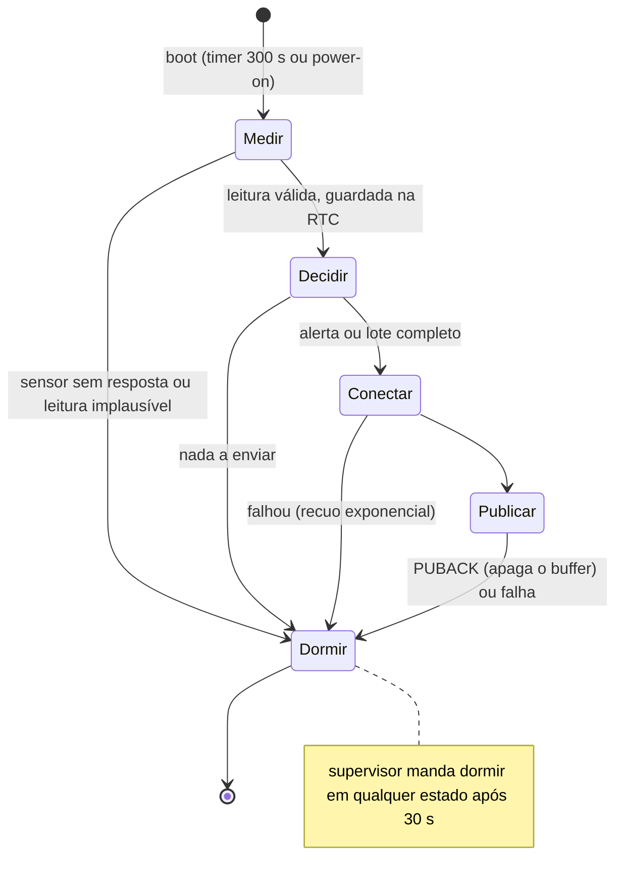

# M1.12.T06 — Documentação e vídeo de demonstração

> Tópico de **elite** (projeto). Tempo previsto: ~25 h — ≈ 3 h de estudo (guias de README e de Markdown do GitHub, Diátaxis, licenças, gravação de tela), ≈ 6 h de documentação (README, organização do repositório, segredos, versão), ≈ 4 h de diagramas finais e BOM com custo, ≈ 7 h de vídeo (roteiro, ensaio, gravação, edição, legenda), ≈ 5 h de relatório de aceite, retrospectiva e apresentação. Última etapa, e a que fecha o Ato 1: o projeto só existe para os outros quando alguém que nunca falou com você consegue **entender o que ele faz, acreditar nos números e reproduzi-lo**. É a "evidência pública" que os critérios de conclusão do ato pedem (repositório, fotos, vídeo) e o que vai para o portfólio. Documentar não é escrever muito: é responder, na ordem certa, às perguntas de quem chega — o que é, funciona mesmo, como reproduzo, quanto custa, o que não faz. Todo número que aparece aqui (autonomia, latência, entrega, custo) precisa apontar para a medida que o gerou nas etapas anteriores.

## Ao final você consegue
- Escrever o README do repositório (problema, demonstração, arquitetura, como reproduzir, resultados medidos contra os requisitos, limitações) e organizar o repositório com licença, segredos fora do git e versão marcada.
- Produzir os diagramas finais (blocos, elétrico, máquina de estados, fluxo de dados) e a BOM com quantidades, fornecedores e custo por unidade em 1 e em 100 unidades.
- Roteirizar, gravar e editar um vídeo de demonstração de 3 a 5 minutos que prove ao vivo os requisitos principais, com relógio visível e números medidos.
- Fechar o projeto com o relatório de aceite (requisito, resultado, evidência, situação), a retrospectiva e uma apresentação do projeto para portfólio e entrevista.

## Estude
- GitHub Docs — *About the repository README file*, *Basic writing and formatting syntax*, *Creating diagrams* (Mermaid no Markdown), *Licensing a repository*, *About releases* e *Managing releases in a repository*.
- **choosealicense.com** (MIT, Apache-2.0, GPL) e a licença **CC BY 4.0** (creativecommons.org) para textos, fotos e vídeo.
- **Diátaxis** (diataxis.fr): os quatro tipos de documentação — *Tutorials*, *How-to guides*, *Reference*, *Explanation* — e por que não se misturam. O README é a porta; cada tipo vai num lugar.
- **Keep a Changelog** (keepachangelog.com) e **Semantic Versioning** (semver.org): `CHANGELOG.md` e o significado de `v1.0.0`.
- **Gitleaks** (github.com/gitleaks/gitleaks): procurar segredos no histórico antes de tornar o repositório público.
- KiCad — documentação do *Schematic Editor*: *Generating a Bill of Materials* e *Plotting and printing* (PDF do esquema).
- OBS Studio — *Quick Start Guide* (cenas e fontes: tela, câmera, celular); um editor como Kdenlive ou Shotcut; YouTube Help — *Upload videos* (visibilidade "não listado") e *Add subtitles*.
- Revise: M0.7.T02 (Git e GitHub), M0.7.T04 (documentação técnica e Markdown), M0.7.T07 (primeiro kit montado e documentado), M0.1.T05 (como ler um datasheet — agora você escreve para quem lê), e os entregáveis de M1.12.T01 a M1.12.T05.

## Resumo
**1. O repositório.** Uma estrutura que qualquer pessoa da área reconhece:
```
estacao/
├── README.md                 # a porta de entrada
├── LICENSE                   # MIT (código) — e CC BY 4.0 para docs, fotos e vídeo, dito no README
├── CHANGELOG.md
├── .gitignore                # segredos.h, .env, *.key, build/, .pio/
├── docs/
│   ├── requisitos.md  arquitetura.md  mensagens.md  fmea.md  plano-de-testes.md
│   ├── adr/0001-wifi-mqtt-tls.md ...
│   ├── relatorio-de-aceite.md  procedimentos.md  retrospectiva.md
│   └── imagens/              # fotos, capturas do dashboard, perfis de corrente
├── hardware/                 # esquema (KiCad + PDF), bom.csv, fotos da montagem
├── firmware/                 # projeto ESP-IDF; main/segredos.exemplo.h
├── teste/                    # testes de unidade no PC
├── servidor/                 # docker-compose.yml, .env.exemplo, mosquitto/, telegraf/, grafana/
└── medidas/                  # CSV dos perfis, eventos.csv, orcamento.py, logs e scripts
```
Regras que separam um repositório amador de um profissional:
- **Segredos nunca entram**, nem em commit antigo: senha do Wi-Fi, senhas do MQTT, token do InfluxDB, chave da CA, token do bot do Telegram. O repositório traz `segredos.exemplo.h` e `.env.exemplo` com valores falsos. Antes de tornar público, rode o **gitleaks** no histórico inteiro; se achar algo, **troque o segredo** (apagar do histórico não desfaz quem já clonou).
- **Licença** explícita: sem ela, ninguém pode legalmente reutilizar o código. MIT para o código é a escolha mais simples; os textos e o vídeo podem ir em CC BY 4.0.
- **Versão marcada**: `git tag v1.0.0` e uma *Release* no GitHub com o binário do firmware, o PDF do esquema e o link do vídeo. O README cita a versão a que os números se referem.
- **Integração contínua** (opcional, mas causa ótima impressão): um *workflow* do GitHub Actions que roda os testes de unidade no PC e compila o firmware a cada *push*. Exemplo (confira a versão da action e do ESP-IDF):
```yaml
name: ci
on: [push, pull_request]
jobs:
  testes:
    runs-on: ubuntu-latest
    steps:
      - uses: actions/checkout@v4
      - run: gcc -std=c11 -Wall -Wextra -Werror -Ifirmware/main -o t firmware/main/ciclo.c teste/teste_ciclo.c && ./t
  firmware:
    runs-on: ubuntu-latest
    steps:
      - uses: actions/checkout@v4
      - run: cp firmware/main/segredos.exemplo.h firmware/main/segredos.h
      - uses: espressif/esp-idf-ci-action@v1
        with:
          esp_idf_version: v5.5
          target: esp32
          path: firmware
```

**2. O README.** Quem chega decide em 30 segundos se continua. A ordem segue as perguntas dessa pessoa:

| Seção | Responde | Conteúdo |
|---|---|---|
| Título + uma frase | o que é? | "Estação de monitoramento de temperatura e umidade a bateria: ESP32, MQTT/TLS, Grafana, 8 meses de autonomia projetada pelo perfil medido." |
| Foto ou GIF + link do vídeo | funciona mesmo? | a estação montada; o vídeo de 3–5 min |
| Resultados | quão bem? | a tabela de requisitos-chave com o **medido** e o link da evidência |
| Arquitetura | como funciona? | o diagrama de blocos e um parágrafo; links para `docs/arquitetura.md` e os ADRs |
| Hardware | o que compro? | resumo da BOM (custo total), link para `hardware/bom.csv` e o esquema |
| Como reproduzir | consigo montar? | passos numerados: servidor (`docker compose up -d`), PKI, senhas, firmware (`segredos.h`, `idf.py build flash`), calibração |
| Limitações e próximos passos | o que não faz? | honestidade técnica: sem OTA, Wi-Fi obrigatório, autonomia projetada (não observada por 8 meses), calibração num só exemplar |
| Licença e créditos | posso usar? | licenças, bibliotecas usadas, referências |

A **tabela de resultados** é o coração do README e o que um avaliador procura:

| Requisito | Critério | Medido | Evidência |
|---|---|---|---|
| RNF-01 exatidão | ≤ ±0,5 °C | +0,21 °C (incerteza 0,15 °C) | `docs/calibracao.md` |
| RNF-02 autonomia | ≥ 183 dias com margem de 30 % | 268 dias (perfil medido) | `medidas/eventos.csv`, `orcamento.py` |
| RNF-03 latência do alerta | ≤ 60 s em ≥ 19 de 20 | 20 de 20, máx. 24 s | `medidas/latencia.csv`, vídeo 1:40 |
| RNF-05 entrega | ≥ 99 % em 7 dias | 99,8 % | captura do painel de entrega |
| RNF-06 custo | ≤ R$ 150 | R$ 140 | `hardware/bom.csv` |

(Os números são os do exemplo de referência dos tópicos anteriores; no seu README vão os seus, com data.)

Estilo: frases curtas, voz ativa, comandos em blocos de código copiáveis, números com unidade, nenhum "simplesmente" ou "é fácil". Um README em português serve ao portfólio no Brasil; para vagas fora, mantenha um `README.en.md` — o inglês técnico do M0.7.T05.

**3. Diagramas finais.** Quatro, cada um com uma pergunta:
- **Blocos** (o do T01, atualizado com o que mudou): *de onde vem e para onde vai cada dado?*
- **Esquema elétrico** (KiCad, exportado em PDF): *como monto?* Com valores, referências e as notas que importam (gate com pull-down, pull-ups no trilho chaveado, capacitor de reforço).
- **Máquina de estados** do firmware (T02): *o que o nó faz em cada situação, inclusive nas falhas?* Em Mermaid, ela fica no próprio Markdown e versionada com o código:

- **Fluxo de dados no servidor** (T04): *por onde passa a medida e o alerta, e quanto tempo leva cada etapa?* O orçamento de latência medido cabe no próprio diagrama.

**4. BOM com custo.** A BOM é uma tabela com referência, descrição, fabricante e código, quantidade, fornecedor, preço unitário em 1 e em 100 unidades, e a **data da cotação**. Exemplo de ordem de grandeza (reais de 2026, **cote os seus**):

| Item | Qtd | R$ (1 un.) | R$ (100 un.) |
|---|---|---|---|
| Módulo ESP32-WROOM-32E | 1 | 32,00 | 22,00 |
| Placa perfurada ou adaptadora | 1 | 6,00 | 2,00 |
| Módulo SHT31 | 1 | 28,00 | 18,00 |
| Célula 18650 2600 mAh | 1 | 25,00 | 18,00 |
| Suporte para 18650 | 1 | 5,00 | 2,50 |
| Módulo carregador TP4056 com proteção | 1 | 6,00 | 3,50 |
| LDO de baixo Iq + capacitores | 1 | 5,00 | 2,00 |
| MOSFETs e resistores (divisor, gate) | 1 jogo | 3,00 | 1,00 |
| Caixa IP54 com respiro | 1 | 22,00 | 14,00 |
| Conectores, fios, parafusos | 1 jogo | 8,00 | 4,00 |
| **Total por unidade** | | **140,00** | **87,00** |

Leituras: o custo cai ~38 % em 100 unidades, e a **caixa** e o **sensor** passam a pesar mais que o MCU — quem pensa em produto olha para eles (no A2, uma placa própria troca módulos por componentes). Ficam **fora** da BOM, mas não do custo do projeto: servidor, frete, impostos de importação, ferramentas e as horas. Gere a BOM do esquema (KiCad) para não divergir dele, e mantenha o `bom.csv` no repositório.

**5. O vídeo de 3 a 5 minutos.** Ele não "mostra o projeto": ele **prova os requisitos** para quem não vai montar nada. Roteiro de referência:

| Tempo | Cena | O que prova |
|---|---|---|
| 0:00–0:20 | o problema em uma frase e a estação no lugar de uso | por que existe |
| 0:20–1:00 | o diagrama de blocos, apontando cada parte | que você entende a arquitetura |
| 1:00–2:10 | **demonstração do alerta ao vivo**: um relógio na tela (ou cronômetro), aquecer o sensor com um secador, o painel subindo, a notificação chegando no celular, o tempo lido no relógio | RF-03 e RNF-03, sem corte no meio |
| 2:10–2:50 | o dashboard: 7 dias de dados, entrega de 99,x %, idade do último lote, bateria | RF-07, RNF-05 |
| 2:50–3:40 | o perfil de corrente no PPK2 (um envio e uma vigília de medida) e a tabela de autonomia v1 → v2 | RNF-02 medido, e o que você otimizou |
| 3:40–4:20 | o que deu errado e o que você mudaria (o bug mais difícil, a limitação principal) | maturidade técnica |
| 4:20–4:40 | link do repositório na tela | onde conferir |

Regras de gravação: **uma tomada contínua** na demonstração do alerta (corte ali parece truque); relógio visível; áudio limpo (um microfone de lapela barato vale mais que uma câmera boa); tela gravada em 1080p com fonte grande no terminal e no navegador; **legenda** (muita gente assiste sem som); nada de música alta. Ensaie com o roteiro escrito e cronometrado; grave em blocos e edite. Publique como "não listado" se não quiser exposição, e ponha o link no README e na *Release*.

**6. O relatório de aceite.** Fecha o plano de testes do T01: uma linha por requisito, com o **resultado medido**, a **evidência** (link para arquivo, captura ou instante do vídeo) e a **situação** — atende, não atende, inconclusivo (medida com incerteza que não permite afirmar) ou não verificado (com o motivo). Um "não atende" bem explicado vale mais que um "atende" sem evidência; esconder um critério que falhou é o que destrói a confiança no resto. Ao lado, a **FMEA final** (RPNs reavaliados depois das ações) e a lista de **riscos residuais**.

**7. Retrospectiva.** Uma página, três colunas: **o que funcionou** (e vale repetir no A2), **o que não funcionou** (com a causa, não a culpa) e **o que tentar** na próxima vez. Inclua as estimativas × o real: horas por etapa, autonomia do T01 × medida, latência estimada × medida. A diferença entre o que se previu e o que aconteceu é o aprendizado mais valioso do projeto — e o assunto preferido de entrevistadores.

**8. Portfólio e entrevista.** Prepare três versões do mesmo projeto:
- **30 segundos** (o *pitch*): o que é, um número medido que impressiona, uma decisão difícil. "Fiz uma estação a bateria com ESP32 que manda dados por MQTT com TLS para um servidor próprio com Grafana. Medi o consumo com um PPK2: a primeira versão dava 5,9 meses; descobri que o Wi-Fi era 76 % da carga, salvei canal e BSSID e passei para 8,8 meses."
- **3 minutos** (o vídeo, ou ao vivo): o roteiro acima.
- **Conversa técnica de 20 minutos**: aqui entra o método **STAR** (Situação, Tarefa, Ação, Resultado) para responder a perguntas como "conte um bug difícil" — por exemplo, o canal salvo que se apagava a cada ciclo porque o `esp_wifi_stop()` também gera o evento de desconexão (T03): situação (p95 alto), tarefa (achar a causa), ação (log das fases, leitura do tratador de eventos), resultado (−71 dias de autonomia evitados, medido).

Perguntas que vão aparecer, e onde está a resposta: por que Wi-Fi e não LoRa (ADR-001)? por que broker próprio (ADR-003)? por que QoS 1 e não 2 (T03)? como você sabe que dura 8 meses (T05, e o que a projeção não cobre)? o que acontece se a internet cair (T03, buffer de 48 medidas)? o que mudaria para fabricar 1000 unidades (BOM em 100, placa própria no A2, provisionamento de credenciais, OTA, certificação)? Responder "não sei, mas mediria assim…" é uma boa resposta; inventar não é.

No **portfólio** (GitHub com o repositório fixado no perfil, LinkedIn, uma página pessoal): uma imagem forte, o *pitch* em texto, o link do vídeo e do repositório. No jogo, o repositório público é a evidência do ato e ganha a relíquia *Rádio do Explorador*.

## Entregáveis e critérios de aceite da etapa
| Entregável | Critério de aceite |
|---|---|
| README | todas as seções da tabela; tabela de resultados com medido e evidência; passos de reprodução testados por outra pessoa ou numa máquina limpa |
| Repositório organizado e público | licença; `.gitignore`; arquivos de exemplo para segredos; gitleaks sem achados; tag `v1.0.0` e *Release* |
| Diagramas finais | blocos, esquema (PDF), máquina de estados, fluxo de dados no servidor; coerentes com o código e o hardware da v1.0.0 |
| BOM (`hardware/bom.csv`) | quantidades, fornecedores, preços em 1 e 100 unidades, data da cotação; total ≤ R$ 150 (TC-09) |
| Vídeo | 3 a 5 min; alerta ao vivo em tomada contínua com relógio; números medidos; legenda; link no README |
| `docs/relatorio-de-aceite.md` | uma linha por requisito com resultado, evidência e situação; FMEA final; riscos residuais |
| `docs/retrospectiva.md` e o *pitch* | estimado × real em horas, energia e latência; *pitch* de 30 s escrito |

## Revisão de projeto (checklist)
- [ ] Um colega (ou você numa máquina limpa) reproduziu o servidor e compilou o firmware só com o README.
- [ ] Cada número do README aponta para a medida que o gerou, com data e versão.
- [ ] As limitações estão escritas, inclusive o que a autonomia projetada não cobre.
- [ ] Nenhum segredo no histórico (gitleaks) e nenhuma chave privada no repositório.
- [ ] Os diagramas batem com o código e o esquema da versão marcada.
- [ ] A BOM tem data de cotação e o total confere com a soma das linhas.
- [ ] O vídeo prova o alerta sem corte, mostra o relógio e cabe em 5 min.
- [ ] O relatório de aceite tem uma linha para cada requisito "deve", inclusive os que não passaram.
- [ ] A retrospectiva compara estimado e real.

## Laboratório

### Material
- O repositório das etapas anteriores, a estação funcionando, o servidor no ar.
- KiCad (esquema e BOM), um editor de diagramas ou Mermaid, uma planilha.
- Celular ou câmera, um microfone de lapela, OBS Studio (gravação de tela com várias fontes), um editor de vídeo (Kdenlive, Shotcut), um secador de cabelo para a demonstração.
- **Sem hardware:** a documentação, a BOM e a estrutura do repositório se fazem sem a estação; o vídeo pode usar a estação simulada e o servidor local para a parte de dashboard e alerta, **declarando isso na tela**. Mas o Ato 1 pede um projeto de verdade: o vídeo final mostra o hardware e as medidas reais.

### Passo a passo
**Experimento 1 — Repositório (≈ 4 h).**
1. Reorganize o repositório na estrutura da seção 1. Escreva o `.gitignore`, os arquivos de exemplo, a `LICENSE` e o `CHANGELOG.md`.
2. Rode o gitleaks no histórico (`gitleaks detect --source . -v`). Se aparecer algo, troque o segredo no serviço e só então limpe o histórico.
3. (Opcional) Configure o workflow de integração contínua e faça um *push* para vê-lo passar.

**Experimento 2 — README e teste de reprodução (≈ 4 h).**
1. Escreva o README na ordem da seção 2, com a tabela de resultados preenchida a partir dos seus relatórios.
2. Peça a alguém para seguir o "Como reproduzir" numa máquina limpa (ou faça você, num usuário novo ou numa VM). Anote cada passo em que a pessoa travou e corrija o README.

**Experimento 3 — Diagramas e BOM (≈ 4 h).**
1. Atualize os quatro diagramas para a versão final. Exporte o esquema em PDF.
2. Gere a BOM do KiCad, complete com fornecedores e preços em 1 e 100 unidades (com data), some e compare com o RNF-06.

**Experimento 4 — Vídeo (≈ 7 h).**
1. Escreva o roteiro com tempos, como na seção 5. Ensaie cronometrando.
2. Grave a demonstração do alerta em tomada única, com relógio na tela. Grave as outras cenas.
3. Edite, legende, confira a duração (3–5 min) e publique. Ponha o link no README e na *Release*.

**Experimento 5 — Aceite, retrospectiva e apresentação (≈ 5 h).**
1. Preencha o relatório de aceite com todos os requisitos e as evidências; atualize a FMEA e os riscos residuais.
2. Escreva a retrospectiva com estimado × real.
3. Escreva o *pitch* de 30 s e treine em voz alta; prepare as respostas STAR para "um bug difícil" e "uma decisão de arquitetura".
4. Marque `v1.0.0`, publique a *Release* e torne o repositório público.

### Evidência
Registre no jogo:
1. **Link do repositório público** na versão `v1.0.0` (com a *Release*).
2. **Link do vídeo** (3–5 min).
3. **Relatório de aceite** e **BOM** (links para os arquivos no repositório).
4. **Saída do gitleaks** sem achados e, se houver, o link do workflow de CI passando.
5. **Pitch de 30 s** escrito e a retrospectiva.
6. **Descrição** (5–10 frases): o que a pessoa que testou o README não conseguiu fazer, qual requisito não passou ou ficou inconclusivo e por quê, o que você mostraria primeiro numa entrevista, e o que vai levar deste projeto para o Ato 2.

## Onde revisar se travar
- Git, tags, releases, histórico: M0.7.T02. Markdown e documentação técnica: M0.7.T04. Inglês técnico: M0.7.T05.
- Números que não fecham: requisitos e plano de testes em M1.12.T01; calibração em M1.12.T02; rede em M1.12.T03; latência em M1.12.T04; energia em M1.12.T05.
- Esquema e componentes: M1.8.T08 (MOSFET como chave), M1.11.T03 (fugas), M0.1.T05 (datasheets).

## Pratique
1. Em que ordem as seções do README devem aparecer, e por quê?
2. Um segredo (a senha do MQTT) foi encontrado num commit de três semanas atrás. O que fazer, e em que ordem?
3. Some a BOM do exemplo em 1 unidade e em 100 unidades. Quanto o custo caiu em porcentagem?
4. Por que a demonstração do alerta deve ser uma tomada contínua com relógio visível?
5. Na tabela de aceite, o RNF-01 ficou com erro de 0,42 °C e incerteza de 0,15 °C. Que situação você registra?
6. Escreva um *pitch* de 30 s para o seu projeto com um número medido e uma decisão.
7. Por que a licença importa num repositório público de portfólio?
8. Responda em STAR: "conte uma decisão técnica que você mudou depois de medir".
9. Que itens ficam fora da BOM mas entram no custo de um produto?

## Armadilhas comuns
- README que começa pela instalação e só no fim diz o que o projeto é.
- Números sem fonte ("dura um ano") ou de datasheet apresentados como medidos.
- Esconder o requisito que não passou.
- Senha ou token no histórico; chave da CA no repositório; apagar o arquivo sem trocar o segredo.
- Repositório sem licença.
- Diagramas de uma versão anterior do projeto.
- BOM sem data de cotação ou com total que não confere; esquecer a caixa e os conectores.
- Vídeo de 12 minutos, sem áudio inteligível, com cortes no meio da demonstração.
- "Funciona na minha máquina": passos de reprodução nunca testados por outra pessoa.
- Apresentar o projeto sem números nem trade-offs ("usei ESP32 porque é bom").

## Gabarito
1. O que é → prova de que funciona (foto, vídeo) → resultados medidos → arquitetura → hardware → como reproduzir → limitações → licença. Segue as perguntas de quem chega: primeiro decidir se vale a pena continuar, depois entender, por fim reproduzir.
2. Primeiro **trocar a senha** no broker (o segredo já vazou para quem clonou). Depois limpar o histórico (`git filter-repo` ou BFG) e forçar o *push*, avisando quem tem cópias; incluir o arquivo no `.gitignore`, criar o arquivo de exemplo e rodar o gitleaks de novo.
3. 1 unidade: 32 + 6 + 28 + 25 + 5 + 6 + 5 + 3 + 22 + 8 = **R$ 140,00**. 100 unidades: 22 + 2 + 18 + 18 + 2,5 + 3,5 + 2 + 1 + 14 + 4 = **R$ 87,00**. Queda: 53/140 = **37,9 %**.
4. Porque o requisito é de tempo: um corte entre o aquecimento e a notificação pode esconder qualquer espera. A tomada contínua com relógio deixa o espectador medir a latência sozinho.
5. **Inconclusivo**: 0,42 + 0,15 = 0,57 °C > 0,5 °C; não dá para afirmar o atendimento. Registre a evidência e o plano para melhorar a verificação.
6. Por exemplo: "Projetei uma estação de temperatura a bateria com ESP32 e MQTT/TLS até um servidor próprio com Grafana. Medi o consumo: 76 % da energia ia na conexão Wi-Fi; salvando canal e BSSID e usando IP fixo, a autonomia projetada foi de 5,9 para 8,8 meses."
7. Sem licença, o código é "todos os direitos reservados": ninguém pode legalmente reutilizar. A licença mostra que você conhece o assunto e deixa claro o que pode ser feito com o trabalho.
8. Situação: a autonomia medida (178 dias) não atendia aos 183. Tarefa: achar o que dominava. Ação: medi cada tipo de vigília com o PPK2, vi que o envio era 76 % da carga, apliquei conexão rápida e IP fixo, medindo uma mudança de cada vez. Resultado: 268 dias, com a taxa de entrega e a latência reverificadas.
9. Montagem e teste, frete e impostos, ferramentas e gabaritos, servidor e operação, certificação (no Brasil, a homologação da Anatel para produtos com rádio — tema do A4), embalagem, garantia e as horas de engenharia.
